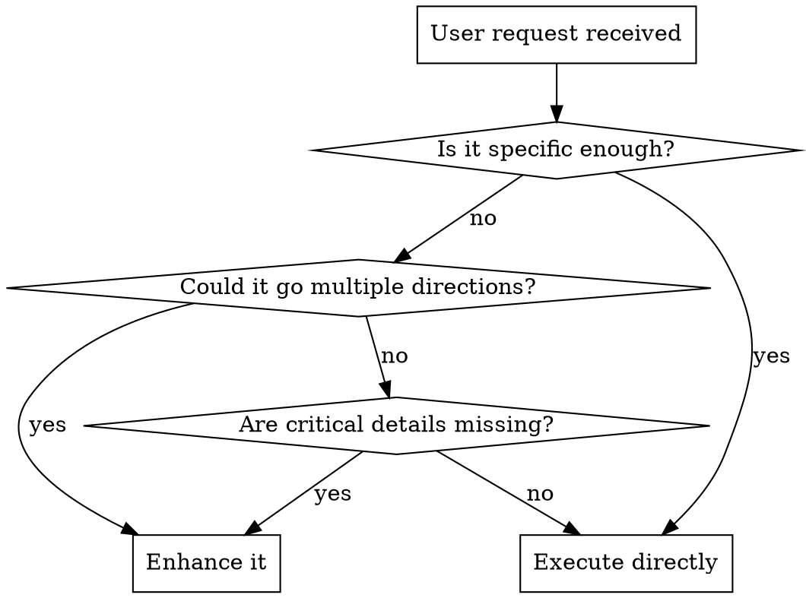

# Prompt Enhancer

Transforms vague requests into precise, actionable prompts. One pass, no back-and-forth.

## When to Use

**Enhance when:** the prompt lacks specifics, has ambiguous terms, omits scope, or could be interpreted multiple ways.

**Skip when:** the request is already specific and actionable, is a follow-up in an established conversation (context is clear), the user prefixes with `*` (bypass), the user says "just do it" or "don't enhance", or the task is a single obvious action.

**Edge case -- ambiguous but runnable:** If a request is 80%+ clear, enhance silently in your reasoning and execute. Only stop to present when the ambiguity could send you in the wrong direction entirely.

## The Enhancement Process

### Step 1: Diagnose

Identify what's missing. Common gaps:

| Gap | Signal | Example |
|-----|--------|---------|
| Missing target | Noun without referent | "fix the bug" (which bug?) |
| Missing scope | No boundaries defined | "refactor the API" (which parts?) |
| Missing criteria | No success measure | "make it better" (better how?) |
| Missing constraints | No rules given | "write an article" (for whom? how long?) |
| Ambiguous action | Verb could mean many things | "handle it" (handle how?) |
| Missing context | No prior state referenced | "update the design" (from what?) |

### Step 2: Context (lightweight, only when needed)

Gather context only if the prompt references specific things that exist in the environment:

- **References files/code**: Quick Glob/Grep to find relevant files. Read 1-2 max. Stop.
- **References prior work**: Check conversation history or memory.
- **General/creative request**: Skip exploration entirely. Enhance from the request alone.

**Do not** explore "just in case." Exploration has a cost. Only explore when the prompt names something specific you can't resolve from context.

### Step 3: Enhance

Restructure the prompt following this framework. Use only the sections that add clarity -- drop sections that would be padding:

**[INTENT]** -- One sentence: what the user actually wants accomplished.

**[SCOPE]** -- What's included and excluded. Named files, components, areas, or boundaries.

**[APPROACH]** -- How to do it, when it matters. Reference existing patterns, tools, or conventions when context was gathered.

**[CONSTRAINTS]** -- Must-follow rules: backwards compatibility, existing patterns, style requirements, platform limits.

**[DELIVERABLE]** -- What the output should look like: file changes, text format, structure, medium.

**[DONE WHEN]** -- Measurable success criteria. How does the user verify it works?

### Step 4: Present

Show the user:
1. The enhanced prompt (the sections above, as a single coherent prompt)
2. A brief note on what changed and why (one line per major addition)
3. Up to 3 critical questions if unknowns remain that block 80%+ of the work

Then wait. Do not execute until the user approves or modifies.

## Enhancement Patterns

| Vague | Enhanced |
|-------|----------|
| "fix the bug" | "Fix [specific condition] in [scope] where [trigger] causes [error], preserving [existing behavior]" |
| "make it better" | "Improve [metric/quality] of [scope] by [approach], measured by [criteria]" |
| "add X" | "Implement [specific behavior] in [scope] following [pattern/convention], with [constraints]" |
| "write about Y" | "Write [format] about [specific angle] for [audience], [length], [tone]" |
| "refactor" | "Restructure [scope] to [goal] while preserving [invariants]" |
| "research Z" | "Investigate [specific question] about [domain], covering [aspects], deliver as [format]" |

## Principles

**Specificity over verbosity.** Better structure, not more words. A 3-line enhanced prompt beats a 20-line one if it captures the same intent.

**Preserve intent.** Never change what the user wants. Only clarify how. If the user says "simple," don't add complexity. If the user says "quick," don't plan a deep approach.

**Positive framing.** Say what TO do, not what NOT to do. "Use tab indentation" beats "Don't use spaces."

**Ground in reality.** When context is gathered, reference actual files, patterns, and conventions. Not hypotheticals.

**Show, don't ask.** Prefer presenting an enhanced prompt with your best interpretation over asking 10 questions. Ask only when a critical unknown blocks most of the work.

**Don't invent requirements.** Enhance what's there. Don't add requirements the user didn't imply. "Fix the bug" doesn't become "Fix the bug and add comprehensive test coverage and documentation."

## Common Mistakes

| Mistake | Fix |
|---------|-----|
| Over-exploring: reading 10 files for context | Read 1-2 files max. Stop. |
| Adding requirements the user didn't ask for | Only clarify, never expand scope |
| Making the prompt longer for the sake of it | If the original is already clear on a dimension, skip it |
| Asking 6+ questions before acting | Present your best interpretation, ask max 3 critical ones |
| Rewriting the user's style/tone | Preserve their voice; enhance structure and specificity |
| Enhancing when not needed | If 80%+ clear, just execute |
| Exploring for creative/general tasks | Skip exploration unless the prompt names something specific |
