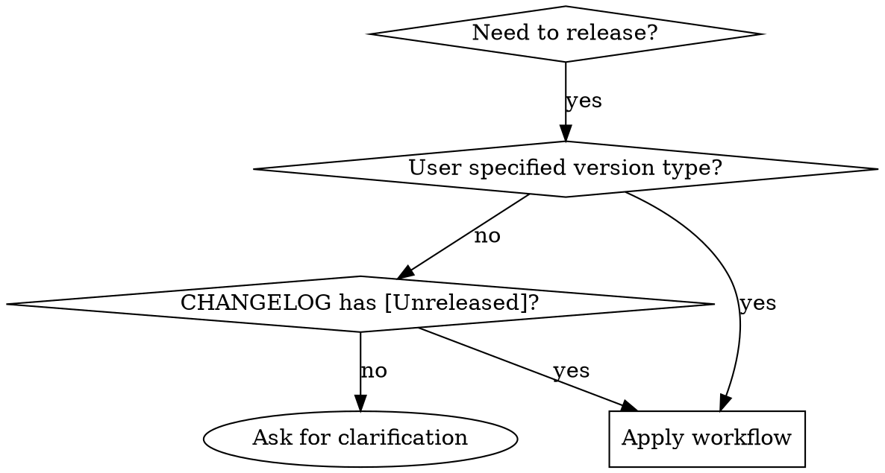

# Intelligent Project Versioning & Documentation

## Overview
A structured workflow for automated version management that calculates semantic versions based on changelog analysis, updates all relevant files, and prepares comprehensive release documentation.

## When to Use



**Use when:**
- User requests release preparation ("prepare release", "time for release", "version bump")
- User provides explicit version increment ("major", "minor", "patch", "fix")
- CHANGELOG.md has entries under `[Unreleased]` section
- Multiple files need version synchronization

**Do NOT use when:**
- User only asks for version number calculation
- Single file update needed
- No changelog entries exist
- User wants to skip documentation updates

## Core Pattern

### Before (Common Mistakes)
```bash
# Inconsistent version detection
agent: "I see package.json has 1.4.2"
agent: "README shows 1.4.2"
# Missing changelog analysis
agent: "This should be a minor version"
# Incomplete file updates
agent: "Just update package.json and README"
```

### After (Skill Approach)
```bash
# Systematic version detection
1. Locate authoritative version source (package.json, app-config.js, etc.)
2. Read current version: 1.4.2
3. Analyze CHANGELOG.md [Unreleased] for increment type
4. Calculate new version based on semantic versioning rules
5. Present plan for approval before making changes
```

## Quick Reference

| Changelog Content | Version Increment | Example Change |
|-------------------|-------------------|----------------|
| `BREAKING CHANGE:` or `### Removed` | **MAJOR** | 1.4.2 → 2.0.0 |
| `### Added` | **MINOR** | 1.4.2 → 1.5.0 |
| `### Fixed`, `### Security` only | **PATCH** | 1.4.2 → 1.4.3 |
| `### Changed` only | **ASK USER** | Ambiguous |

## Implementation

### Step 1: Version Calculation Logic

**Priority Order (MUST follow):**

1. **Explicit user input** (highest priority)
   - User says "major", "minor", "patch", "fix"
   - Use this increment type directly

2. **CHANGELOG.md analysis** (automatic inference)
   ```yaml
   BREAKING_CHANGE: major
   ### Removed: major
   ### Added: minor
   ### Fixed: patch
   ### Security: patch
   ### Changed: ambiguous
   ```

3. **User clarification required** (fallback)
   - Only `### Changed` or ambiguous content
   - Present analysis with clear choices
   - MUST NOT guess the increment type

### Step 2: Pre-flight Verification

Before any file modifications:

```xml
<thinking>
1. Current version source: [file path]
2. Current version read: [X.Y.Z]
3. Increment type: [user explicit/inferred/clarification needed]
4. Calculated new version: [A.B.C]
5. Required files present: ✓
Plan ready for execution.
</thinking>
```

**Present confirmation:**
> "I will increment the version to `[A.B.C]`. Is this correct?"

### Step 3: File Update Sequence

**Execute in exact order:**

1. **Update central version source**
   - `package.json` → `version` field
   - `app-config.js/yaml` → `version` property
   - Use authoritative source for your project

2. **Update CHANGELOG.md**
   ```markdown
   ## [A.B.C] - YYYY-MM-DD
   [move content from Unreleased here]

   ## [Unreleased]
   [leave empty for next release]
   ```

3. **Update README.md version badge**
   ```markdown
   [](CHANGELOG.md)
   ```

### Step 4: Documentation Intelligence

**Analyze changelog for documentation impact:**

- **`Added`** → Update architecture docs, setup guides
- **`Changed`** → Update existing documentation sections
- **`Removed`** → Remove or deprecate documentation
- **`Fixed`** → Usually no documentation needed

**CRITICAL:** Present proposed documentation changes for user approval before applying.

### Step 5: Release Preparation

**Output commit template (DO NOT execute):**
```
A.B.C [short, descriptive title]

- [bulleted summary of key changes]
- Update project documentation to reflect new changes.
```

## Common Mistakes

| Mistake | Fix |
|---------|-----|
| Guessing version from multiple files | Identify single authoritative source |
| Ignoring CHANGELOG analysis | Follow semantic versioning inference rules |
| Updating files in wrong order | Use the prescribed sequence |
| Applying docs changes without approval | Always get user sign-off first |
| Executing git commands automatically | Only prepare commit message |

## Real-World Impact

- **Consistent releases**: Every release follows identical process
- **Version accuracy**: Semantic versioning applied correctly based on changes
- **Documentation quality**: Docs stay synchronized with code changes
- **Reduced errors**: Safety checks prevent incomplete releases

## Red Flags - STOP and Start Over

- Making version assumptions without evidence
- Skipping changelog analysis
- Updating files without user confirmation
- Applying documentation changes without approval
- Executing git commands automatically

**All of these mean: Re-read the skill and follow the workflow exactly.**