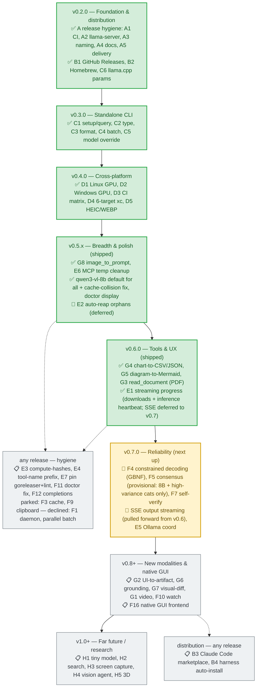

# Roadmap

This is a living document. It organizes everything **localvision** is heading
toward — the scattered `v0.1.1` / `v0.2` notes that used to live in source
comments and Known-Limitations lists, plus the feature ideas that drive the
next several releases.

New ideas are added here first, sequenced and scoped, before any code. If an
item isn't in this file, it isn't planned.

## How to read this

- Work is grouped into **themes** (A–H), each anchored to a target version.
- Each item carries an **effort** guess (`XS / S / M / L / XL`) and a
  **status**: ✅ done · 🚧 next up · 📋 planned · 🔬 needs design.
- Versions are advisory, not commitments. Items move between them freely.
- Until v1.0, minor versions may break compatibility (see `CHANGELOG.md`).

## Where we are now

**v0.6.0 shipped.** Themes **A–D are done**, the **v0.5 series** (breadth &
polish) shipped across three point releases, and **v0.6 (tools & UX)** shipped
G3 + G4 + G5 + E1. `localvision` builds and runs on macOS (Apple Silicon/Intel),
Linux, and Windows (x86_64 + arm64) — all six targets cross-compiled from one
runner (pure Go, CGO off). Linux/Windows detect CUDA/ROCm/NVIDIA GPUs and size
model selection against VRAM; a first-wins converter chain
(`sips → magick → heif-convert → ffmpeg`) handles HEIC/WEBP everywhere; CI runs
on ubuntu/windows/macos.

What **works** (shipped):
- **11 MCP tools** over the MCP `run` command — incl. `image_to_prompt` (v0.5.0)
  and `read_document` (v0.6.0).
- The full **one-shot CLI**: `--type` (11 tools), `--format`, `--output-mode`
  (structured chart/diagram), batch (`--output`/`--output-dir`/`--meta`), the
  `setup` wizard.
- **Structured chart output** (G4, v0.6.0): `describe_chart --output-mode csv|json`.
  **Editable diagram markup** (G5, v0.6.0): `describe_diagram --output-mode mermaid`.
- **PDF ingestion** (G3, v0.6.0): `read_document` rasterizes a PDF via a
  `$PATH`-discovered chain (`pdftoppm → mutool → magick/convert → gs`) and
  summarizes it in one inference.
- **Streaming progress** (E1, v0.6.0): the CLI spinner and MCP
  `notifications/progress` report real byte (downloads) + elapsed (inference)
  progress instead of going silent. (Real token-by-token SSE is deferred to v0.7.)
- **`qwen3-vl-8b` (Q8) as the default model for all tools** (v0.5.1, re-analyzed
  quality+speed; the 27B champion is opt-in via `--model`).
- Model files **cached per-model** with auto-migration (v0.5.1 fixed a bug that
  re-downloaded the projector on every model switch).
- MCP `callTool` temp-file hygiene (v0.5.0, E6) and a `doctor` default-model
  display that matches tool selection on every tier (v0.5.2).
- Hardware detection (Apple Silicon + Linux CUDA/ROCm + Windows CUDA);
  VRAM-aware selection; cross-platform HEIC/WEBP; spawn-on-demand lifecycle with
  warm reuse; SHA256 verification.
- Installs via **Homebrew** (macOS), `curl|sh` (darwin/linux), `go install`
  (all platforms).

What's **next** — the v0.6 tools & UX tier is shipped. The next release tier is
**v0.7 — reliability** (see **Sequencing & priorities** below):
- **F4 constrained decoding (GBNF)** — guarantee well-formed JSON/CSV so the
  structured-output tools (G4/G5) are reliable, not prompt-begged.
- **SSE output streaming** — real token-by-token progress (pulled forward from
  v0.6's elapsed heartbeat), reinforcing E1.
- **F5 multi-sample consensus** (provisional) and **F7 self-verification**.

Explicitly **not** pursuing (see **Server & process model**): a background
daemon / HTTP service (F1) — the current model is good enough; clipboard (F9) /
result cache (F3) are low-value and parked.

After v0.7: **v0.8+ new modalities** (UI→code, video, grounding), and further
out a **native GUI frontend**.

---

## Server & process model

How `localvision` runs today, and why a background-service mode was evaluated
and **declined**.

**Today — client-spawned, on-demand (stdio MCP).**

- The MCP server (`localvision run`) is launched **by the client** (Claude Code,
  Cursor, …) as a stdio subprocess, via the `mcpServers` block in `plugin.json`
  (`command: localvision, args: [run]`). One subprocess per client session; the
  client owns its lifecycle (spawn on connect, kill on disconnect).
- The **skill** (`SKILL.md`) launches **nothing** — it is guidance for the
  assistant on *when* to call the vision tools. Process lifecycle comes from the
  `mcpServers` config, not the skill.
- The heavy **`llama-server`** is lazy-spawned on the first tool call, kept warm
  for the idle window (default 5 min), then auto-killed. Cold start ~30–70 s per
  session; warm calls 5–25 s.
- **No system daemon** (launchd/systemd) is installed.

**Decision (v0.5.x): no daemon.** A lingering / always-on / HTTP service
(formerly F1) was evaluated and **declined**. Its benefits — cross-session
warmth, a persistent CLI, non-MCP reach — are mostly theoretical for a personal
local tool, while the cost (persistent process + IPC + single-instance + crash
recovery + supervision) is real. The current model above is the chosen design:
the MCP client keeps the server warm for the session, and one-shot CLI calls
terminate and unload — with **batch amortizing the cold start** across many
images (already shipped in v0.3.0: `localvision *.png --output-dir out/`). If
reach is ever genuinely wanted, an HTTP listener can be added to the lifecycle
later; until then F1, F2 (OpenAI-compat), and a web UI are **not pursuing**.

---

## Roadmap at a glance

All themes (A–H) and tasks, one node per release phase, read top → bottom.
Each node is colored by the phase's status and lists its tasks with a per-task
marker: ✅ shipped · 🚧 next up · 📋 planned · 🔴 deferred. Dotted lines mark the
cross-cutting "any release" pools.

---

## Theme A — Release hygiene (unblock shipping) → `v0.2.0`

The foundation. Nothing downstream (releases, Homebrew, marketplace) is
trustworthy until CI is green and the shipped `llama-server` is pinned. This
theme is the gate for the first real `v0.2.0` tag.

### A1. Fix the CI build ✅ `S` — *(done in v0.2.0)*

**Root cause (diagnosed):** `internal/llama/client_test.go` has two tests —
`TestBuildChatRequestBodyImageURLs` (~line 280) and
`TestBuildChatRequestBodyContainsNoShell` (~line 364) — that pass fake paths
like `/tmp/foo.png`. Production code changed: `buildChatRequestBody`
(`client.go:439/484`) now inlines images as `data:` URIs (it `os.ReadFile`s
each path) because recent `llama-server` rejects `file://` unless `--media-path`
is set. The fixtures don't exist on disk, so both tests fail. Build + vet pass;
`go test -race` is the red step.

**Fix:** write fixtures into `t.TempDir()` before calling
`buildChatRequestBody`, and assert the data-URI JSON shape instead of the
stale `file://` substrings at `client_test.go:292-293`. Failure predates the
rename — it is not a path/import issue.

**Blocks:** every release-dependent item (B1, B2).

### A2. Acquire `llama-server` safely ✅ `M` — *(done in v0.2.0)*

Dropped the `TODO-PHASE3` placeholder. localvision now **prefers a
user-installed `llama-server` on `$PATH`** (e.g. `brew install llama.cpp`;
warned as unverified); if absent it downloads a **pinned official llama.cpp
release tag** and verifies the **archive SHA256** before extracting the dylib
bundle. No custom build or self-hosting. See `internal/llama/binary.go`.

**Pairs with A5** (how the binary reaches the user).

### A3. Unify naming ✅ `XS` — *(this update)*

The server was keyed three different ways across the repo (`"local-vision"` in
`plugin/plugin.json` and `docs/INSTALL.md`, `"localvision"` in `scripts/install.sh`
and the README). All are now standardized on **`localvision`**.

### A4. Reconcile documentation ✅ `M` — *(this update)*

Fix the v0.1 → v0.2 drift across README, CHANGELOG, ARCHITECTURE, TOOLS, and
the plugin SKILL (catalog names, tier list, benchmark wording, stale
"Phase 0" / "stub" language).

### A5. `llama-server` delivery ✅ `M` — *(done in v0.2.0)*

The release pipeline ships only the `localvision` wrapper (goreleaser,
`CGO_ENABLED=0`); `llama-server` is **not** bundled — it is resolved at the
first tool call per A2 (prefer `$PATH`, else download a pinned official
tar.gz). `scripts/build-llama-cpp.sh` is retained as a dev/convenience way to
build a local `llama-server` for `$PATH` (not part of the release).

---

## Theme B — Distribution (get it into users' hands) → `v0.2.0`–`v0.3.0`

### B1. GitHub Releases ✅ `S` — *(done in v0.2.0)*

First GitHub Release cut (`v0.2.0`: archive + `checksums.txt` + `install.sh`).
goreleaser builds `darwin/arm64`. Note: goreleaser OSS can't parse the Go
subdirectory-module tag, so the release workflow normalizes
`mcp/localvision/vX.Y.Z` to a local bare `vX.Y.Z` tag (the subdir tag stays on
the remote for `go install`), and `.goreleaser.yaml` uses `gomod.proxy: false`.

### B2. Homebrew ✅ `S–M` — *(done in v0.2.0)*

`brews:` stanza added; goreleaser publishes `Formula/localvision.rb` to
[`froggeric/homebrew-tap`](https://github.com/froggeric/homebrew-tap) using a
dedicated **fine-grained `HOMEBREW_TAP_GITHUB_TOKEN`** (contents:write on the
tap only — rotated from the maintainer's broad gh token in v0.4). Install:
`brew tap froggeric/homebrew-tap && brew trust froggeric/tap && brew install
localvision`.

### B3. Claude Code marketplace plugin 📋 `M` — *(idea 6)*

The current `plugin/` dir holds a `plugin.json` + `SKILL.md` but is **not** in
marketplace layout — there is no `.claude-plugin/marketplace.json`. Today users
install the binary then hand-paste an `mcpServers` snippet. Add the marketplace
manifest and repo structure so localvision is one-click installable from the
Claude Code plugin marketplace.

### B4. Auto-detect & install into AI coding harnesses 📋 `M–L` — *(idea 7)*

Detect installed coding agents (Claude Code, Codex CLI, Gemini CLI, Cursor,
Continue, etc.) and offer to wire `localvision` into each one's MCP/config
automatically. This is the onboarding half of the **C1** setup wizard — when a
user runs `localvision` with no args, the interactive setup (C1) should find
their harnesses (B4) and configure them.

---

## Theme C — Standalone CLI (the flagship shift) → `v0.3.0`

Today `localvision` is **MCP-only**: the only inference path is
MCP-client → JSON-RPC → `CatalogExecutor`. Theme C turns the same binary into a
first-class **shell tool** you can call directly — `localvision describe
shot.png`, pipeable, scriptable, batchable. This is the largest capability
expansion in the roadmap and unlocks ideas 2–5, 10.

The reuse is clean: `tools.Tool.BuildRequest` + `Executor.Run` +
`Tool.ParseOutput` (`internal/mcpserver/executor.go:71`, `internal/tools/tool.go`)
are already **MCP-agnostic**. A new CLI subcommand can construct the executor
exactly as `main.go:119-130` does and skip the MCP SDK entirely.

### C1. Single executable: interactive setup + one-shot queries ✅ `L` — *(done in v0.3.0)*

- **No args** (interactive terminal) → `setup` wizard: detect hardware, pick a
  model, check `llama-server`, show paths, write `~/.localvision/config.toml`.
  No args over a non-TTY stdio (how MCP clients connect) → the MCP server.
- **With args** → one-shot image query against a tool, prints to stdout.

Delivered with a **framework-free stdlib wizard** (numbered menus + the project's
existing ANSI helpers) — zero new dependencies. A richer bubbletea TUI was
evaluated and deferred to keep the v0.2-era lean dependency tree (4 direct deps)
intact; tracked below as a future enhancement. `internal/setup` holds the
testable logic; `cmd/localvision/setup.go` is the thin interactive driver.

### C2. `--type` query parameter with optimized prompts ✅ `S–M` — *(done)*

Each tool already has a task-tuned, benchmark-informed system prompt
(`internal/tools/prompt.go`). Expose them as a `--type`/`--tool` flag on the
one-shot path: `--type ocr`, `--type diagram`, `--type chart`, `--type code`,
`--type ui`, `--type error`, `--type compare`, default `describe`. No new
prompts to write — reuse the existing task-tuned ones (now 10, incl.
`image_to_prompt`/`--type prompt` from v0.5.0).

### C3. `--format` output parameter ✅ `M–L` — *(done in v0.3.0)*

Shipped as `--format text|markdown|json|yaml|xml` via a **CLI-layer
post-processor** (`internal/tools/format`) rather than changing `ParseOutput` or
the 9 prompts — the MCP path is untouched. Machine formats wrap the result in
`{tool, result}` and are always structurally valid. *Limitation:* without
constrained decoding (Theme F4), JSON wraps the model's natural output rather
than imposing a per-tool schema; `extract_code`'s `{language, code}` is the one
structured result today. `Config.default_format` sets a default.

**`exif`** (write the result as image metadata via `exiftool`) remains a future
enhancement — it is a distinct output sink needing a writable target, so it is
gated on a richer `--output` story.

### C4. Output to file + batch processing ✅ `M` — *(done in v0.3.0)*

Shipped: `--output FILE` (single) / `--output-dir DIR` (one file per input),
glob/directory/stdin input expansion (`cmd/localvision/expand.go`), `--recursive`,
`--meta` telemetry sidecar, and `--type compare` grouping inputs into pairs.
Threading the per-inference stats back required the one interface change in
v0.3.0: `Executor.Run` now returns `(raw, Stats, error)` where
`Stats{Model, TokensIn, TokensOut, ElapsedMs}` feeds `--meta`. A warm
`llama-server` is reused across the batch.

### C5. Manual model override ✅ `S–M` — *(done)*

`--model <id>` per invocation, plus wiring the **currently-unused**
`Config.DefaultModel` field (`config.go:47`) into the executor. Today
`CatalogExecutor.Run` calls `catalog.ModelFor(toolID, hw)` and ignores
`cfg.DefaultModel` entirely — it's a latent field. Add: explicit `--model`
override → honor it; else honor `default_model` if set; else catalog autoselect.

### C6. Benchmark-faithful `llama.cpp` parameters ✅ `S–M` — *(done in v0.2.0)*

The v6 benchmark produced its quality with a specific `llama-server` invocation
(`benchmark/vlm/code/benchmark_llamaserver.py:139`). Reproduce it exactly so
shipped quality matches the benchmark:

**Sampling (HTTP request body):**
`temperature 0.1`, `top_p 0.95`, `top_k 64`, `max_tokens 16384`. (Temperature
0.1 is already hardcoded at `executor.go:117`; the rest need adding.)
`chat_template_kwargs.enable_thinking=false` is already carried per-model in
`builtin.toml`.

**Subprocess launch flags:**
`-np 1` (single-slot), `-b 4096 -ub 4096` (batch sizes large enough that image
tokens — up to ~2240 — never split across physical batches; the default `-ub
512` splits a 548-token image into two passes and degrades quality). `-ngl` /
`-c` are already per-model in the catalog (`ctx=32768`, `gpu_layers=-1`).

Low risk, no API change, high value for existing MCP users — **candidate to
pull forward into `v0.2.0`** alongside A1–A4.

---

## Theme D — Cross-platform → `v0.4.0` ✅

`v0.4` adds Linux and Windows (x86_64 + arm64) alongside macOS. The wrapper is
pure Go (CGO off), so goreleaser cross-compiles all six targets from one runner;
CI runs `vet`/`test -race`/`build` on ubuntu/windows/macos. Discrete-GPU model
selection now sizes against VRAM (CUDA/ROCm detected), not host RAM.

- **D1.** Linux hardware detection — CUDA + ROCm. `M` ✅ *(done in v0.4.0)*
- **D2.** Windows hardware detection — CUDA (DirectML deferred). `M` ✅ *(done in v0.4.0)*
- **D3.** CI matrix: ubuntu/windows/macos in `vision-mcp-ci.yml`. `S` ✅ *(done in v0.4.0)*
- **D4.** goreleaser cross-compile: six targets (darwin/linux/windows × arm64/amd64)
  from one macos runner (CGO off). `S` ✅ *(done in v0.4.0)*
- **D5.** Cross-platform HEIC/WEBP conversion — opportunistic converter chain. `S–M` ✅ *(done in v0.4.0)*
  First-wins chain over **CLI-only, `$PATH`-discovered** tools: `sips` (macOS) →
  `magick`/`convert` (ImageMagick) → `heif-convert` (libheif) → `ffmpeg`. Use
  whatever the user already has installed; convert to JPEG/PNG because
  `llama-server` (stb_image) can't read HEIC natively. WEBP stays on the same path.

  Design decisions:
  - **Opportunistic, not ImageMagick-only.** ImageMagick's HEIC is frequently
    broken out-of-the-box (delegate not compiled in; `policy.xml` blocks
    HEIC/HEIF by default). A chain is far more robust than betting on one tool.
  - **CLI-only / headless-safe.** Exclude GUI viewers with bolt-on CLIs
    (IrfanView, XnView MP): localvision runs headless (MCP server, batch, cron),
    where GUI apps flash windows, return inconsistent exit codes, and fail in
    non-interactive sessions. (`nconvert` — XnView's real CLI, self-contained
    HEIC codec — is the one GUI-family tool that'd be acceptable; deferred
    unless Windows-HEIC-without-ffmpeg becomes a real pain point.)
  - **Never bundle a decoder.** HEIC uses HEVC (patent-encumbered: MPEG-LA /
    HEVC Advance). Redistributing *any* HEVC decoder — `nconvert`/IrfanView
    (freeware; no redistribution rights anyway), `libheif`+`libde265`, or a
    static ffmpeg-with-heif — puts the project on the hook for HEVC patent
    licensing. This is why we bundle MIT-licensed `llama-server` but **no HEIC
    decoder**: MIT grants redistribution; freeware and patent-encumbered codecs
    do not. HEIC is, by nature, "bring your own decoder."
  - **Error UX.** When no converter is found, emit a clear message naming
    installable options — incl. IrfanView/XnView/nconvert for Windows users who
    already have them — instead of a macOS-only wall.

**Known limitation:** Linux/Windows GPU detection is unit-tested (parsers +
selection logic) and runs clean on GPU-less CI, but isn't validated on real
CUDA/ROCm hardware from the dev machine (macOS). `default_model` overrides any
misdetection. DirectML detection on Windows is deferred.

---

## Theme E — Hardening & polish → ongoing (E1 done `v0.6`, E6 done `v0.5`; E2 deferred)

The long tail of known limitations, mostly small, mostly independent.

- **E1.** ✅ **Done in v0.6.0.** Streaming progress for long operations — **both**
  downloads (model/binary fetch bytes, `%` + MiB) **and** inference (phase
  transitions + a climbing elapsed heartbeat), surfaced to the CLI spinner and
  MCP `notifications/progress` (clients opt in via `_meta.progressToken`; no
  token = no notifications). Implementation: a ctx-carried, nil-safe progress
  Sink (`internal/progress`) threaded through the lifecycle, executor, and MCP
  `callTool`, with no change to the `tools.Executor` interface. Real
  token-by-token **SSE output streaming is deferred to v0.7** (the elapsed
  heartbeat already kills the silence; SSE pulls forward alongside F4 constrained
  decoding). `M`
- **E2.** Auto-reap orphan `llama-server` subprocesses on startup (today:
  manual via `pkill -fa llama-server`; `doctor` does not yet detect them).
  *Deferred from v0.5.0:* investigation showed no orphan-detection code exists,
  ports are ephemeral, and there is no PID file or argv marker — so safe reaping
  needs a marker plus a parent-liveness check (to avoid killing a different live
  instance's subprocess) and cross-platform process enumeration. That is an `M`,
  not an `S`, and carries automatic-kill risk, so it is re-scoped to a later
  release rather than rushed at the zero-problem bar. `M`

  *(No longer subsumed — the F1 daemon was declined, so E2 stays a standalone
  deferred item for the stdio MCP mode. Low priority: orphans are rare and the
  workaround is `pkill -fa llama-server`.)*
- **E3.** `doctor --compute-hashes` to populate catalog SHA256s automatically
  (today: by hand). `S`
- **E4.** Configurable tool-name prefix to avoid MCP collisions (tool names are
  unprefixed today). `S`
- **E5.** Automatic Ollama coordination (unified-memory contention on Apple
  Silicon; today `doctor` only warns if `:11434` is occupied). `M`
- **E6.** ✅ **Done in v0.5.0.** The MCP `callTool` path now reuses
  `tools.ParseImageRef` (which registers data-URI temp files for cleanup) and
  reaps them with `tools.CleanupImageRefs` after each call — matching the
  one-shot CLI path. The MCP path's private `dataURIToTempFile` duplicate is gone.
- **E7.** Pin `goreleaser` to a known-good major version in the release
  workflow (today `brew install goreleaser` is unpinned) and add a `lint`
  (golangci-lint) step to CI. `S`

---

## Theme F — Reach & power → `v0.7.0+`

Make localvision faster, more reliable, and reachable far beyond a single MCP
client. Several items here are small and can be pulled forward into any release.

- **F1. ~~HTTP/REST service + background daemon~~ — not pursuing (decided v0.5.x).**
  A lingering / always-on / HTTP daemon was evaluated and declined: its benefits
  (cross-session warmth, persistent CLI, non-MCP reach) are mostly theoretical
  for a personal local tool, and the cost (persistent process + IPC +
  single-instance + crash recovery) is real. The current client-spawned model is
  good enough; batch amortizes the CLI cold start (see **Server & process
  model**). An HTTP listener can be grafted onto the lifecycle later if reach is
  ever wanted.
- **F2. ~~OpenAI-compatible `/v1/chat/completions`~~ — not pursuing.** Depended
  on F1 (the HTTP service), which was declined. Revisit only if F1 is ever built.
- **F3. ~~Content-addressed result cache~~ — parked (low value).** Reuse the
  per-image SHA256 as a cache key for instant replay of repeated queries. Low
  priority: overlaps little with real workflows and adds a cache-invalidation
  surface. Revisit if a concrete need appears.
- **F4. Constrained decoding (GBNF grammars)** — constrain `llama-server` output
  to valid JSON/CSV/table shape so structured formats are *guaranteed*
  well-formed, not prompt-begged. The real engine behind a reliable `--format`
  (reinforces C3). `M`
- **F5. Multi-sample consensus (union@N)** — 🚧 **scaffolded (experimental,
  off by default).** Run N warm samples on an image and fuse them into one
  comprehensive result. The mechanism is built and A/B'd on the 8B:
  - **Per-tool recipe** (from `benchmark/vlm/CATEGORY-REPORT.md`): `union@0.7`
    for `read_image` / `describe_ui` / `describe_chart`; `union@0.4` for
    `extract_text` (OCR peaks at mid-temp); **single** for `extract_code` /
    `describe_diagram` / `diagnose_error` (systematic errors — sampling can't
    help). Encoded in `tools.SamplingFor`.
  - **The gate**: temperature. At 0.1 the N runs come out ~identical and
    correlation adds nothing; the benefit only appears at 0.4–0.7. So the
    raised temp applies *only when sampling* — single calls stay at 0.1
    (today's behavior).
  - **The mechanism**: N `ChatVision` calls (warm — the lifecycle keeps the
    model in-slot, so calls 2–N are 1.1–1.6× cheaper) → a text-only **merge
    pass** on the same warm model fusing the N outputs into one. The merge is
    the non-obvious part: you can't string-union prose.
  - **A/B** (`describe_chart`, 8B): union@3 = 51.5s (~2.1× single's 24s) and
    surfaced more detail (dual-axis/dotted-points, quantified the pCO₂ range,
    sharper inflection) — "cheap long-tail polish, not a quality revolution"
    (the model already scores 85% single). On a single-mode tool
    (`extract_code --sample 3`) it correctly no-ops to one call.
  - **Status**: CLI `--sample N` opts in; default off. On-by-default waits on a
    second image per category (the report is n=1/directional) and a
    hallucination/precision metric on the merge. `S/M` (see
    `benchmark/vlm/{REPEAT,CATEGORY}-REPORT.md`)
- **F6. Per-tool model routing** — ✅ **Done (scaffolded).** The catalog now
  routes per tool via `preferred_for` (no selection-code change): `qwen3.5-4b-q8`
  ← `extract_code`/`describe_ui`/`describe_diagram`/`diagnose_error`, `qwen3-vl-8b`
  ← the rest. Both new models are mirrored to huggingface.co/froggeric/ and in
  the catalog (the MoE is opt-in — only beats the 8B for `read_image` coverage
  WITH `--sample`). Per-tool `[tools.<id>]` config (model + method) + a setup-
  wizard one-click "recommended routing" + a `doctor` routing table round it out.
  `default_model` is now a fallback (no longer a forced override), so routing is
  the default. **Tradeoff**: mixed-tool sessions switch models (cold reload per
  switch); the wizard defaults to single-model + opt-in to preserve warm reuse.
  From `benchmark/vlm/BENCHMARK-REPORT-v5.md`'s use-case table. `M`
- **F7. Self-verification pass** — for `extract_text`/`extract_code`, a second
  cheap call re-checks the extraction against the image and flags mismatches.
  Catches hallucinations. `S/M`
- **F8. `doctor --selftest`** — run a handful of `benchmark/vlm/test-images`
  against the installed model and sanity-check output against `GROUND-TRUTH.md`.
  One-command "does my install actually work," reusing assets you already ship. `S`
- **F9. ~~Clipboard in/out~~ — parked (low value).** Read a screenshot from the
  clipboard / copy the result back out. Low priority vs other tool work.
- **F10. Watch mode** — `localvision watch ~/Screenshots --type ocr` processes
  every new file automatically. Hands-off pipelines. `S`
- **F11. `doctor --fix`** — let `doctor` auto-remediate (clear corrupt cache,
  re-download, re-pin), not just diagnose. `XS`
- **F12. Shell completions + examples-rich help** — bash/zsh/fish/PowerShell
  completions and a great `--help`. Cheap polish, big feel. `XS`
- **F13. Model management subcommands** — `localvision models list/pull/remove/
  switch`, pre-fetch. Make the catalog first-class instead of auto-magic only. `S`
- **F14. MCP resources & prompts** — expose the catalog, benchmark summary, and
  tool-selection guidance as MCP `resources`, and the 10 task prompts as reusable
  `prompts`, so agents can introspect "which model and why" without a tool call. `S`
- **F15. Local usage stats** — `localvision stats` (calls, models, tokens, time),
  purely local and opt-in. `S`
- **F16. Native GUI frontend** — a native (macOS-first) app: drop/paste an image,
  pick a tool, see results. Embeds localvision as a Go library (no daemon/HTTP
  needed). Brings localvision to non-developers; further down the line (v0.8+).
  (A web-UI variant was considered and dropped — it depended on the declined F1
  HTTP service.) `L`

---

## Theme G — Expanded tool set & new modalities → G3/G4/G5 done `v0.6`; G1/G2/G6/G7 → `v0.8+`

New tools and richer output, motivated by a comparison against a peer server.

### Tool landscape vs. `zai_mcp_server`

`zai_mcp_server` exposes 8 vision tools. localvision covers 5 of them 1:1 and
has 4 dedicated tools zai lacks (incl. `read_document` for PDFs). Two real gaps:

| `zai_mcp_server` | localvision | status |
|---|---|---|
| `analyze_image` | `read_image` | ✅ covered |
| `extract_text_from_screenshot` | `extract_text` | ✅ covered |
| `diagnose_error_screenshot` | `diagnose_error` | ✅ covered |
| `understand_technical_diagram` | `describe_diagram` | ✅ covered |
| `analyze_data_visualization` | `describe_chart` | ✅ covered (angle: numbers vs insights) |
| `ui_diff_check` | `compare_images` | ◐ partial — generic vs UI-regression |
| `ui_to_artifact` | `describe_ui` (prose only) | ✗ **gap** — no code/spec artifact (G2) |
| `analyze_video` | — | ✗ **gap** — no video (G1) |
| — | `extract_code` | ★ localvision advantage (zai has none) |
| — | `extract_table` | ★ localvision advantage (zai has none) |
| — | `image_to_prompt` | ★ localvision advantage (zai has none) |
| — | `read_document` (PDF) | ★ localvision advantage (zai has none) |

### Items

- **G1. Video analysis** (`analyze_video`) — extract keyframes via `ffmpeg`,
  analyze + summarize. Fills the `analyze_video` gap; new modality. `L`
- **G2. UI → artifact** (`ui_to_artifact`) — from a UI screenshot, emit
  **code** (HTML/Tailwind/React), a **design spec**, a **rebuild prompt**, or a
  description. Fills the `ui_to_artifact` gap; `describe_ui` becomes the
  description mode of a more powerful tool. `M/L`
- **G3. PDF / multi-page / document ingestion** — ✅ **Done in v0.6.0** as the
  `read_document` tool. Rasterizes a PDF via a `$PATH`-discovered chain
  (`pdftoppm`/`mutool`/`magick`/`convert`/`gs`), sends the page images to the
  model in one inference, and summarizes (per-page highlights + tables/figures).
  Up to 20 pages. No decoder bundled. DOCX/slides would need LibreOffice — not in
  v0.6 (PDF only); revisit if demand appears. `M`
- **G4. `describe_chart` → structured data** — ✅ **Done in v0.6.0.** An optional
  `output` argument returns the underlying numbers as CSV or JSON (not just
  prose). "Get this graph into my spreadsheet." JSON is surfaced as MCP
  structured content. `S`
- **G5. `describe_diagram` → editable markup** — ✅ **Done in v0.6.0.** An
  optional `output=mermaid` emits editable Mermaid markup that reproduces the
  diagram. Image → round-trippable, editable diagram. (PlantUML/graph JSON
  deferred unless asked.) `S`
- **G6. Coordinate grounding** — have `describe_ui`/`describe_diagram` return
  bounding boxes (Qwen3-VL supports grounding) so agents can crop/click/replay. `M`
- **G7. `compare_images` → UI regression + visual diff** — specialize the
  expected-vs-actual case and optionally emit a highlighted diff image. `S/M`
- **G8. Image → generation prompt** (`image_to_prompt`) — ✅ **Done in v0.5.0.**
  Produces a structured diffusion-ready prompt (subject, medium/style, composition
  & camera details, lighting, color palette & mood, plus a paste-ready
  comma-separated tag line) that recreates the image. The inverse of `read_image`:
  describe → prose; this → a prompt to *reproduce*. Generator-agnostic; the
  optional `question` steers it toward Midjourney/SDXL/Flux/DALL·E or a style.
  Shipped as a core `--type prompt` / `image_to_prompt` tool. `S`

**Preserve as differentiators:** `extract_code`, `extract_table`,
`read_document` (PDF), and **G8 image→prompt** — tools `zai_mcp_server` has no
equivalent for. Keep them best-in-class.

---

## Theme H — Far future (research-grade) → `v1.0+`

Ambitious, far-fetched, explicitly invited for the later roadmap.

- **H1. `localvision-tiny`** — distill/fine-tune a small vision model on the v6
  benchmark ground-truth for a project-tuned, ultra-fast local model. `XL`
- **H2. Local image library + semantic search** — embed and index every analyzed
  image; "find the screenshot where…". `L`
- **H3. Live screen-region capture** — continuously watch and analyze a screen
  region for automation/accessibility. `L`
- **H4. Autonomous multi-step vision agent** — the model drives its own
  crop→zoom→re-read loop on hard images. `L`
- **H5. Multi-view scene / 3D reconstruction** — reconstruct a scene from
  several images. `XL`

---

## Sequencing & priorities

Themes **A–D are done** (v0.2.0–v0.4.0 shipped). The **v0.5 series shipped**:
v0.5.0 (G8 image→generation-prompt tool + E6 MCP temp-file cleanup), v0.5.1
(`qwen3-vl-8b` as the default for all tools, re-analyzed quality+speed, plus a
fix for the model-file re-download bug — a shared `mmproj-F16.gguf` basename
collision — by caching models per-model-subdirectory with auto-migration), and
v0.5.2 (a `doctor` default-model display fix so it matches tool selection on
every hardware tier). **v0.6.0 shipped tools & UX**: G3 (`read_document` PDF
ingestion), G4 (chart → CSV/JSON), G5 (diagram → Mermaid), and E1 (streaming
progress for downloads + inference; SSE deferred to v0.7). The remaining work is
reorganized into value-prioritized releases: reliability next, then new
modalities. Effort in parentheses (`XS/S/M/L`); versions are advisory.

### v0.5.x — Breadth & polish  *(mostly XS–S; high value-per-effort)* — **SHIPPED**
- ✅ **v0.5.0** — **G8** image→generation-prompt (10th tool, `--type prompt` /
  `image_to_prompt`) + **E6** MCP temp-file cleanup (the `callTool` path no longer
  leaks one `image_data` temp file per call).
- ✅ **v0.5.1** — **`qwen3-vl-8b` default for all tools** (re-analyzed quality+speed;
  the 27B champion is opt-in via `--model`) + **model-file re-download fix**
  (per-model subdirs + auto-migrate; the shared `mmproj-F16.gguf` basename
  collision that re-downloaded the projector on every model switch).
- ✅ **v0.5.2** — **`doctor` default-model display** now matches tool selection on
  every hardware tier (was showing the 27B on 49+ GB Macs while tools used the 8B).
- *Deferred:* **E2 auto-reap orphans** — re-scoped to `M` (needs a process marker
  + parent-liveness check; no detection exists yet). See Theme E2.

Hygiene items cherry-pick freely into any release:
- E3 doctor --compute-hashes `S` · E4 tool-name prefix `S` · E7 pin goreleaser + lint `S` · F11 doctor --fix `XS` · F12 shell completions `XS`
- *Parked (low value, for now):* F3 result cache · F9 clipboard
- *Declined:* F1 daemon/HTTP · F2 OpenAI-compat · parallel batch processing

### v0.6.0 — Tools & UX  *(S–M; concrete, demand-driven)* — **SHIPPED**
Top priority was **more / better tools**; the one UX item was **streaming**.
- ✅ **G4 `describe_chart` → CSV/JSON `S`** — `output` arg returns the underlying
  numbers (CSV for spreadsheets, JSON as structured content).
- ✅ **G5 `describe_diagram` → Mermaid `S`** — `output=mermaid` emits editable markup.
- ✅ **G3 PDF / multi-page documents `M`** — the new `read_document` tool
  rasterizes a PDF (`pdftoppm`/`mutool`/`magick`/`gs`) and summarizes it.
- ✅ **E1 streaming progress `M`** — real byte (downloads) + elapsed (inference)
  progress via a ctx-carried Sink; CLI spinner + MCP `notifications/progress`.
  *(Real token-by-token SSE deferred to v0.7.)*
- *(Not in v0.6:)* F8 doctor --selftest `S` · F12 shell completions `XS` · E3 doctor --compute-hashes `S`.

### v0.7.0 — Reliability  *(M; quality)* — **next up**
- **F4 constrained decoding / GBNF grammars `M`** — guarantees well-formed JSON/CSV so G4/G5 structured output is reliable, not prompt-begged.
- **SSE output streaming** — real token-by-token progress, pulled forward from v0.6's elapsed heartbeat (reinforces E1).
- **F5 multi-sample consensus (union@N)** `S/M` — 🚧 **scaffolded behind `--sample` / `[tools.<id>].method` (off by default), A/B'd on the 8B**; v0.7 graduates it (on-by-default per-tool once a 2nd image/category + a merge-precision metric land). See Theme F5.
- ✅ **F6 per-tool model routing** `M` — done: catalog `preferred_for` partition (4B-Q8←code/ui/diagram/error, 8B←rest), both new models mirrored, `[tools.<id>]` config, setup-wizard one-click, doctor routing table. MoE opt-in. See Theme F6.
- F7 self-verification `S/M` · E5 Ollama coordination `M`

### v0.8.0+ — New modalities & native GUI  *(L)*
- G2 UI→artifact/code `M/L` · G6 coordinate grounding `M` · G7 compare→visual-diff `S/M` · G1 video `L` · F10 watch mode `S`
- **F16 native GUI frontend** `L` — macOS-first; embeds localvision as a library. Further down the line.

### Distribution *(land in any release above)*
- **B3** Claude Code marketplace plugin `M` — independent after B1.
- **B4** auto-detect & wire AI coding harnesses `M–L` — pairs with the C1 setup wizard for onboarding.

### v1.0+ — Far future / research: H1–H5.

**The path so far:** A1→B1→B2 (distribution) ✅ → C1–C6 (CLI) ✅ → D1–D5
(cross-platform) ✅ → **v0.5.x (G8 tool + E6 leak fix; qwen3-vl-8b default;
model-cache collision fix; doctor display)** ✅ → **v0.6 (tools & UX: G3
read_document + G4 chart→CSV/JSON + G5 diagram→Mermaid + E1 streaming
progress)** ✅ → **v0.7 (reliability: F4 constrained decoding + SSE output
streaming + F5/F7)** 🚧. A background daemon (F1) was evaluated and declined.

## Idea index

| # | Idea | Item | Target |
|---|---|---|---|
| 1 | Fix GitHub Actions compilation | A1 | v0.2.0 |
| 2 | Single executable: interactive + parametric queries | C1 | v0.3.0 |
| 3 | `--format` output parameter (incl. exif) | C3 | v0.3.0 |
| 4 | Output to file / batch | C4 | v0.3.0 |
| 5 | `--type` query parameter + optimized prompts | C2 | v0.3.0 |
| 6 | Claude Code marketplace deployment | B3 | v0.3.0 |
| 7 | Auto-detect & install AI coding harnesses | B4 | v0.3.0 |
| 8 | Homebrew install | B2 | v0.2.0 |
| 9 | GitHub Releases | B1 | v0.2.0 |
| 10 | Manual model override | C5 | v0.3.0 |
| 11 | Benchmark-faithful llama.cpp parameters | C6 | v0.2.0 |
| 12 | Image → generation prompt (reproduce an image) | G8 | v0.5.0 |

Pre-existing items folded in: pin `llama-server` SHA (A2), naming (A3),
binary pipeline (A5), streaming (E1), auto-reap (E2), `--compute-hashes` (E3),
tool-name prefix (E4), Ollama coordination (E5), temp-file cleanup (E6),
release-tool pinning + lint (E7), cross-platform (D1–D5).

Themes **F** (Reach & power, F1–F16), **G** (Expanded tools, G1–G8), and **H**
(Far future, H1–H5) are proposed additions — not from the original 11 user
ideas. They are exploratory; cherry-pick freely.
